# Smart Resume Screener 📄🤖


## Overview

The Smart Resume Screener is a robust backend application designed to automate and enhance the initial stages of the technical recruitment process. It intelligently parses candidate resumes (PDF or TXT), leverages the Google Gemini Large Language Model to score them against a given job description, and provides a ranked shortlist of candidates with detailed, AI-generated justifications.

This project demonstrates a modern, API-driven approach to solving a real-world business problem, combining solid backend engineering with the power of generative AI.

---

## Key Features

- **Multi-Format Resume Parsing:** Accepts and extracts text from both **PDF** and plain text (`.txt`) resume files.
- **AI-Powered Analysis:** Utilizes the Google Gemini API to perform a semantic analysis of a resume against a job description.
- **Structured Data Extraction:** Extracts a quantifiable **match score** (1-10), a detailed **justification**, and a list of **relevant skills**.
- **Full CRUD Functionality:** Provides a complete RESTful API for Creating, Reading, and **Deleting** jobs and resumes.
- **Interactive Web Dashboard:** Includes an optional, server-rendered frontend built with **Thymeleaf** for easy interaction with the API.

---
## Tech Stack & Tools

- **Backend:** Java 17+, Spring Boot (Spring Web, Spring Data JPA), Thymeleaf, Google Gemini API, Apache PDFBox
- **Database:** MySQL
- **Build & Dependencies:** Maven, Lombok, Jackson
- **Tools & Environment:** Git & GitHub, Postman, IntelliJ IDEA

---
## Architecture

The application is designed with a clean, maintainable, and scalable architecture.

### High-Level System Architecture

The system consists of three primary components: the central API, a persistent database, and an external AI service. The client interacts exclusively with the API, which orchestrates all internal logic and external calls.


### Internal Application Architecture

The application's internal structure follows a classic **Layered Architecture**, a core design principle for building robust backend services. This separates the code into distinct layers (Controller, Service, Repository), each with a specific responsibility.

```mermaid
sequenceDiagram
    actor Client
    participant ScreeningController
    participant ScreeningService
    participant LLMService
    participant MySQL_Database as 💾 Database
    participant Gemini_API as 🧠 Google Gemini API

    Client->>ScreeningController: POST /api/screen (IDs)
    activate ScreeningController

    ScreeningController->>ScreeningService: screenResume(resumeId, jobId)
    activate ScreeningService

    ScreeningService->>MySQL_Database: findById(resumeId)
    MySQL_Database-->>ScreeningService: Resume Data

    ScreeningService->>MySQL_Database: findById(jobId)
    MySQL_Database-->>ScreeningService: Job Description Data

    ScreeningService->>LLMService: scoreResume(texts)
    activate LLMService

    LLMService->>Gemini_API: HTTPS POST Request (Prompt)
    activate Gemini_API
    Gemini_API-->>LLMService: JSON Response
    deactivate Gemini_API

    LLMService-->>ScreeningService: Parsed ScreeningResult
    deactivate LLMService

    ScreeningService->>MySQL_Database: save(ScreeningResult)
    MySQL_Database-->>ScreeningService: Confirms Save

    ScreeningService-->>ScreeningController: Returns Saved Result
    deactivate ScreeningService

    ScreeningController-->>Client: 200 OK Response (JSON)
    deactivate ScreeningController
```




---

## 🚀 API Usage Workflow

This application provides a powerful set of decoupled API endpoints. To get the most out of the system, these endpoints are designed to be called in a logical sequence to perform a complete screening task.

The following flowchart illustrates the standard end-to-end workflow. It serves as a quickstart guide for a user to go from creating a job and uploading a resume to seeing the final, AI-powered screening results. This sequential process ensures that all necessary data is persisted before the analysis is performed.

---

## API Documentation

| Method | Endpoint | Description | Request Body Example |
| :--- | :--- | :--- | :--- |
| `POST` | `/api/jobs` | Creates a new job description. | `{"jobTitle": "...", "content": "..."}` |
| `GET` | `/api/jobs` | Retrieves a list of all jobs. | (None) |
| `DELETE` | `/api/jobs/{id}` | Deletes a job by its ID. | (None) |
| `POST` | `/api/resumes/upload` | Uploads a candidate's resume. | `form-data` with `name` (text) and `file` (file) keys. |
| `GET` | `/api/resumes` | Retrieves a list of all resumes. | (None) |
| `DELETE` | `/api/resumes/{id}` | Deletes a resume by its ID. | (None) |
| `POST` | `/api/screen` | Scores a resume against a job. | `{"resumeId": 1, "jobId": 1}` |
| `GET` | `/api/jobs/{jobId}/shortlist`| Gets all scored candidates for a job. | (None) |

---

## Setup and Installation

To run this project locally, please follow these steps:

1.  **Clone the repository:**
    ```bash
    git clone [https://github.com/abh1shekChoudhary/Smart-Resume-Screener.git](https://github.com/abh1shekChoudhary/Smart-Resume-Screener.git)
    cd Smart-Resume-Screener
    ```

2.  **Set up the Database:**
    - Ensure you have a MySQL server running.
    - Create a new database named `resume_screener_db`.
    ```sql
    CREATE DATABASE resume_screener_db;
    ```

3.  **Configure Environment Variables:**
    - In `src/main/resources/`, rename `application.properties.example` to `application.properties`.
    - Open the new `application.properties` file and update the following fields with your credentials:
        - `spring.datasource.username`
        - `spring.datasource.password`
        - `gemini.api.key`

4.  **Build and Run the Application:**
    - Use Maven to run the application:
    ```bash
    mvn spring-boot:run
    ```
    - The application dashboard will be available at `http://localhost:8080`.


---

## LLM Prompt Engineering

The core AI functionality relies on a multi-faceted approach to prompt engineering to ensure reliable, accurate, and safe outputs from the Google Gemini model.

### 1. Prompt Design

The prompt is structured to guide the model's behavior and output format.

- **Role Prompting:** The model is assigned a clear role (`act as an expert evaluator`) to frame its context and produce higher-quality analysis.
- **Structured Output Instruction:** The prompt explicitly instructs the model to return its analysis in a **clean JSON object**. This is critical for reliable, programmatic parsing on the backend.
- **Clear Task Definition:** The task is unambiguously defined: compare texts, rate on a specific scale, provide a justification, and extract relevant skills.

**Prompt Used:**
Compare the following resume with this job description. Your task is to:

Rate the fit on a scale of 1-10.

Provide a detailed justification for your rating.

Extract a list of the top 5-7 most relevant skills from the resume that match the job description.

The resume is: {resumeText}. 
The job description is: {jobDescriptionText}.

Return your answer as a clean JSON object with three keys: 'score' (an integer), 'justification' (a string), and 'skills' (an array of strings).


### 2. Generation & Safety Configuration

Beyond the prompt text, the application configures the model's generation parameters to control the output's quality and consistency.

**Generation Configuration:**
| Parameter | Value | Purpose |
| :--- | :--- | :--- |
| `temperature` | `0.7` | Balances creativity and factual consistency in the justification. |
| `topP` | `0.95` | Controls the diversity of the response. |
| `topK` | `64` | Limits the token selection to the most likely choices. |
| `maxOutputTokens` | `8192` | Sets a generous limit for the length of the AI's response. |

**Safety Settings:**
The application implements standard safety settings to ensure all AI-generated content remains professional and appropriate.

| Category | Threshold |
| :--- | :--- |
| `HARM_CATEGORY_HARASSMENT` | `BLOCK_MEDIUM_AND_ABOVE` |
| `HARM_CATEGORY_HATE_SPEECH` | `BLOCK_MEDIUM_AND_ABOVE` |
| `HARM_CATEGORY_SEXUALLY_EXPLICIT`| `BLOCK_MEDIUM_AND_ABOVE` |
| `HARM_CATEGORY_DANGEROUS_CONTENT`| `BLOCK_MEDIUM_AND_ABOVE` |


### 3. Robust Output Handling

The application anticipates and handles a common LLM behavior: wrapping JSON responses in Markdown. A post-processing step sanitizes the model's output to ensure the parser receives a clean, valid JSON string.

```java
// Example of the cleaning logic in LLMService.java
String cleanedJson = llmResponseText.trim().replace("```json", "").replace("```", "");
This multi-step process of prompt design, configuration, and output handling demonstrates a comprehensive approach to integrating generative AI into a production-ready application.
